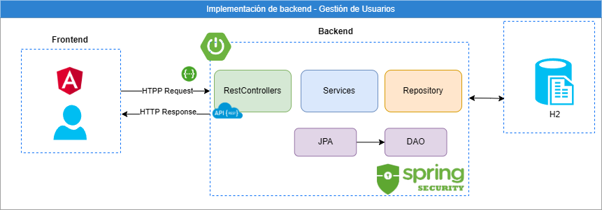
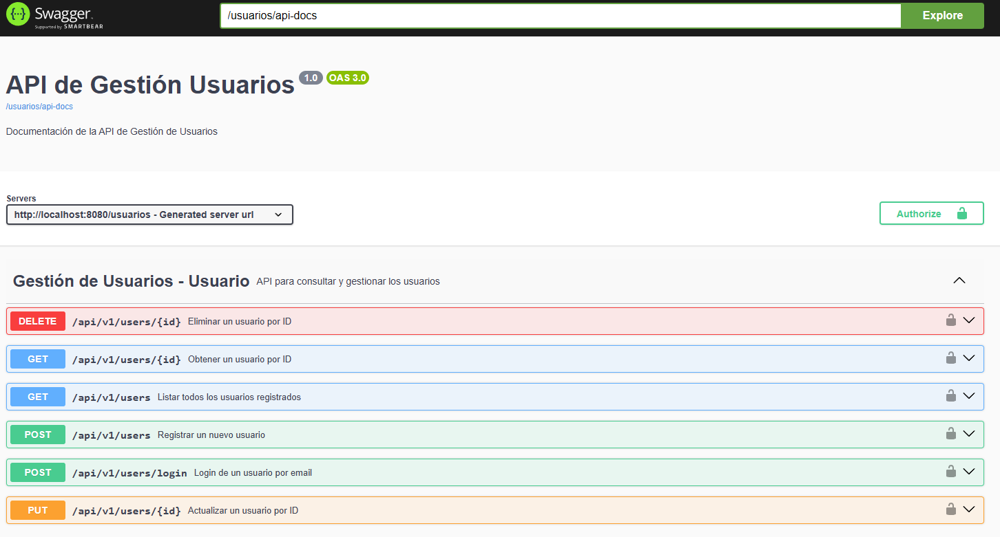
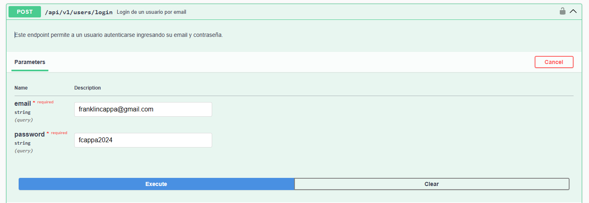

# API de Gestión de Usuarios

Este proyecto es una API RESTful desarrollada con **Spring Boot** que permite gestionar usuarios, incluyendo el registro, inicio de sesión (login) y CRUD básico. También utiliza **JWT** 

## Tecnologías utilizadas
- **Java 17** 
- **Spring Boot 3.3.4**
- **Spring Security** para la gestión de autenticación/encriptación de password
- **JWT (JSON Web Tokens)** para autenticación basada en tokens
- **Spring Data JPA** para la interacción con la base de datos
- **H2 Database** como base de datos en memoria
- **JUnit 5** y **Mockito** para pruebas unitarias
- **Lombok** para reducir el código boilerplate
- **Swagger OpenAPI** para la documentación de la API

## Diagrama de Solución


## Estructura de carpetas

```plaintext
src
 ├── main
 │   ├── java
 │   │   └── com.gestionusuarios.usuarios
 │   │       ├── controller
 │   │       ├── dto
 │   │       ├── entity
 │   │       ├── exception
 │   │       ├── repository
 │   │       ├── security
 │   │       ├── service
 │   │       └── config
 │   └── resources
 │       └── application.properties
 └── test
     └── java
         └── com.gestionusuarios.usuarios
             └── service
```

## Instalación y configuración
**Requisitos previos**
- Tener Java 17 o superior instalado.
- Tener configurado Maven para la compilación.
- Clonar repositorio: **git clone <url-del-repositorio>**
- Ejecutar proyecto: **mvn spring-boot:run**

La aplicación estará disponible en http://localhost:8080/usuarios



**Configuraciones**
Las configuraciones las puede realizar en el archivo **application.properties**
- Config de Base de datos **H2** 
- Regex para password.
- Clave secreta de Token y tiempo de expiración


## Probar API

**Registro de Usuario**
- Para registrar un nuevo usuario, utiliza el siguiente curl o una herramienta como Postman:
```plaintext

curl -X POST http://localhost:8080/usuarios/api/v1/users \
-H "Content-Type: application/json" \
-d '{
    "name": "Juan Perez",
    "email": "juanperez@inadvance.com",
    "password": "password123",
    "phones": [
        {
            "number": "987654321",
            "citycode": "1",
            "contrycode": "57"
        }
    ]
}'

```
**Login de Usuario**
- Para probar login desde swagger: http://localhost:8080/usuarios/swagger-ui/index.html#/




**Nota: El proyecto incluye un test de Login General**